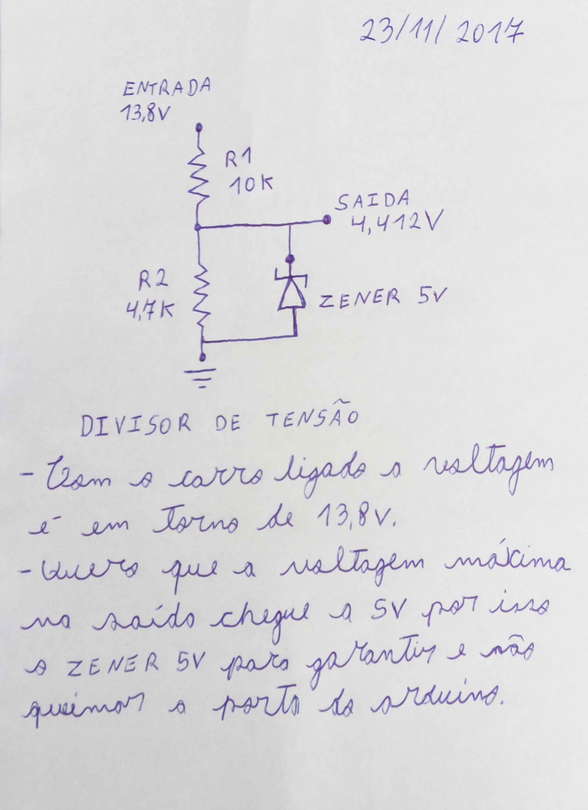

  

Itens a considerar  
- Voltagem com o carro ligado fica em torno de 13,8v
- Adicionado diodo zener de 5v para dar segurança ao circuito e não deixar ultrapassar a voltagem máxima de 5v, para que não danifique a porta do arduino.
  
Sites que ajudam a fazer o cálculo para o divisor de tensão.  
[Calculadora Online - Divisor de tensão com resistores](
http://www.arduinoecia.com.br/p/calculador-divisor-de-tensao-function.html)  
[Voltage Divider](http://hyperphysics.phy-astr.gsu.edu/hbase/electric/voldiv.html)
